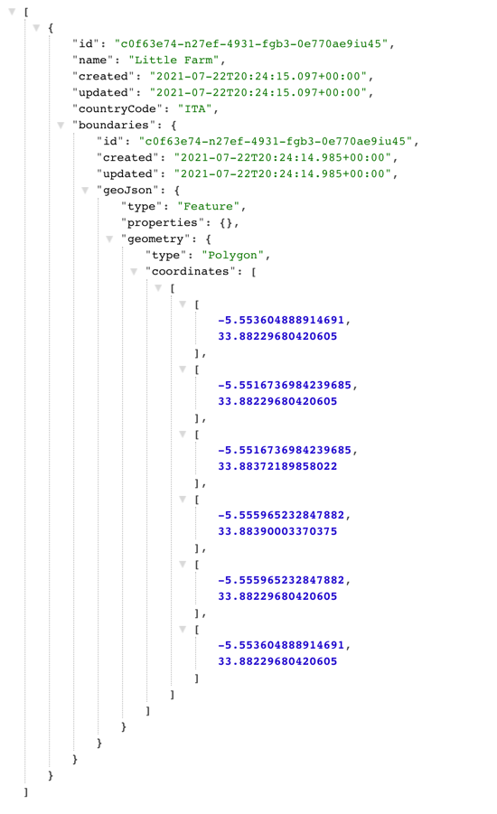
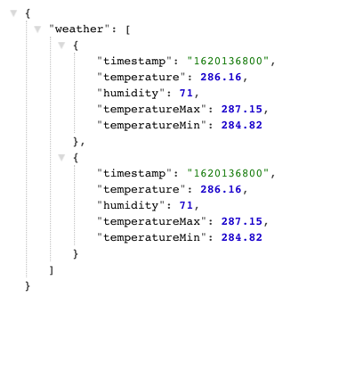

# Installation
After cloning the project go inside its folder and run

` docker compose up `

It will compile the app image and deploy its container in conjunction with a postgres one.

The app uses port 8080

# Endpoints

Interacting with the API can be made using localhost:8080 during development

`localhost:8080/`

### Get all fields
GET request to fields/
`localhost:8080/fields`

Sample response:


### Get a single field using an id parameter
GET request to fields/{id}

`localhost:8080/fields/c0f63e74-n27ef-4931-fgb3-0e770ae9iu45`

### Create an item
POST request to fields/

`localhost:8080/fields/`

Sample Body
```
{
    "id": "c0f63e74-n27ef-4931-fgb3-0e770ae9iu45",
    "name": "Little Farm",
    "created": "2021-08-01T00:00:00.000+00:00",
    "updated": "2021-08-01T00:00:00.000+00:00",
    "countryCode": "ITA",
    "boundaries": {
        "id": "c0f63e74-n27ef-4931-fgb3-0e770ae9iu45",
        "created": "2020-07-25T10:03:56.782Z",
        "updated": "",
        "geoJson": {
            "type": "Feature",
            "properties": {},
            "geometry": {
                "type": "Polygon",
                "coordinates": [
                    [
                        [
                            -5.553604888914691,
                            33.88229680420605
                        ],
                        [
                            -5.5516736984239685,
                            33.88229680420605
                        ],
                        [
                            -5.5516736984239685,
                            33.88372189858022
                        ],
                        [
                            -5.555965232847882,
                            33.88390003370375
                        ],
                        [
                            -5.555965232847882,
                            33.88229680420605
                        ],
                        [
                            -5.553604888914691,
                            33.88229680420605
                        ]
                    ]
                ]
            }
        }
    }
}
```

### Update an item
PUT request to fields/

`localhost:8080/fields`
```
{
    "id": "c0f63e74-n27ef-4931-fgb3-0e770ae9iu45",
    "name": "Little Farm",
    "created": "2021-08-01T00:00:00.000+00:00",
    "updated": "2021-08-01T00:00:00.000+00:00",
    "countryCode": "ITA",
    "boundaries": {
        "id": "c0f63e74-n27ef-4931-fgb3-0e770ae9iu45",
        "created": "2020-07-25T10:03:56.782Z",
        "updated": "2020-08-05T10:03:56.782Z",
        "geoJson": {
            "type": "Feature",
            "properties": {},
            "geometry": {
                "type": "Polygon",
                "coordinates": [
                    [
                        [
                            -5.553604888914691,
                            33.88229680420605
                        ],
                        [
                            -5.5516736984239685,
                            33.88229680420605
                        ]
                    ]
                ]
            }
        }
    }
}
```

### Delete an item using an id parameter
DELETE request to fields/{id}

`localhost:8080/fields/c0f63e74-n27ef-4931-fgb3-0e770ae9iu45`

### Get Weather History for a field using an id parameter
GET request to fields/{id}/weather

`localhost:8080/fields/c0f63e74-n27ef-4931-fgb3-0e770ae9iu45/weather`

Sample response


# Postman
A Postman requests export is available within the project, just import **agro-api.postman_collection.json**

# Considerations 

For most projects I would store the entities with a regular integer/long primary key id field, but for this project let the string ids from the request being used as primary keys just for simplicity.

I worked to generate the requests to the Polygon and WeatherHistory endpoints until the requests worked, and I received a invalid Api Key error, after this point I used MockServer to mock the request responses.

Files responsible for Mock Responses from OpenWeather
```
polygonResponse.json
weatherResponse.json
```